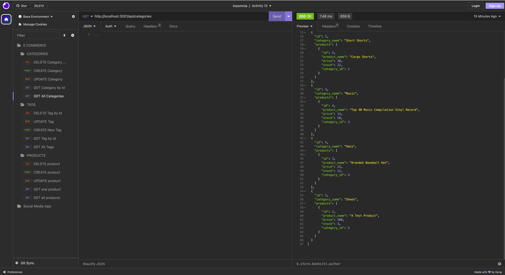

# Module13-EComBackend

## Description
          
This program is an API or back-end for a E-commerce site. It demonstrates how a database can be manipulated to retrieve data, for one product, tag and category, or multiple products, tags and categories. Often business's need their databases to be flexible so they can add, update and delete new products, necessary tags and categories, and this is possible due to specific routes that retrieve specific data and allow it to be modified.

<br> Take a look at some of the data manipulations possible with this backend program <br>


<br>


Check out how the generator works though this video 
<br>
<br>


## Table of Contents

* [Technologies](#technologies)
* [Installation](#installation)
* [Usage](#usage)
* [License](#license)


## Technologies

- MySQL
- Express.js
- Sequelize
- Javascript
- npm
- node.js
- Heroku
- dotenv package

## Installation

- Clone the github repository and install any dependencies with the command ```npm i```
- Run the database schema within the mysql shell with the command ```source db/schema.sql```
- Don't forget to seed the database with the command ```npm run seed```
- Start the server with the command ```npm start```

## License

For more info check [MIT License](https://opensource.org/licenses/MIT)


## Questions

For any issues, please contact me at:
slenorovitz@gmail.com
<br>
Or check out my Github page https://github.com/GypsyBoho